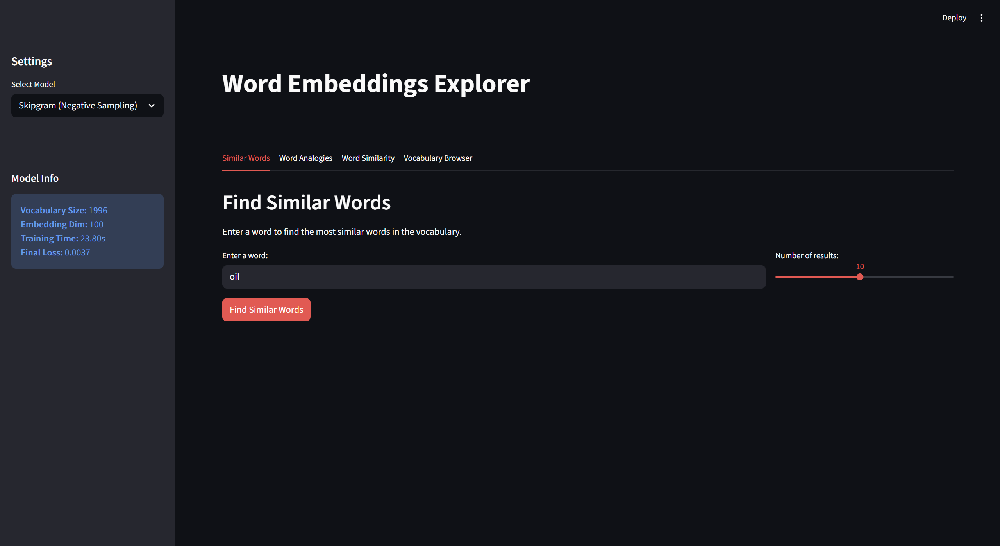
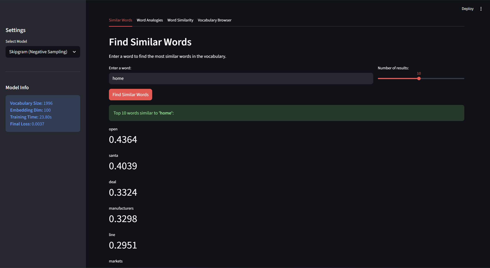
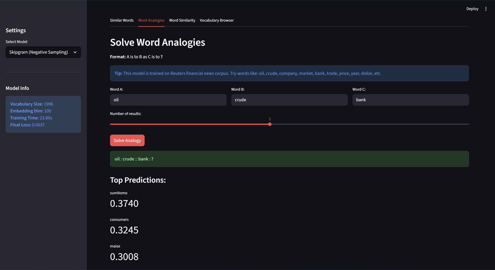
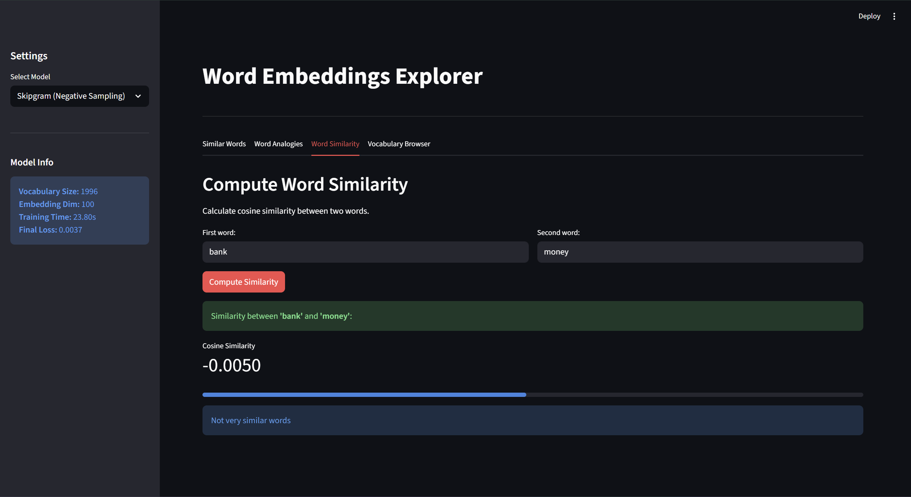
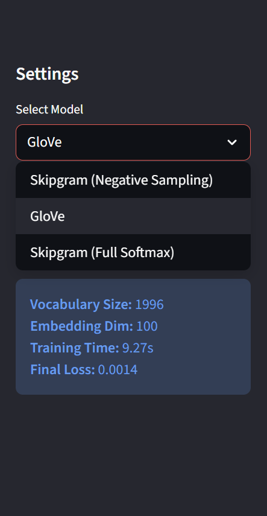

# NLU Assignment 1 - Word Embeddings

**Student:** Muhammad Fahad Waqar  
**Student ID:** st125981

## Assignment Overview

This Assignment implements and compares three word embedding models:
1. **Skipgram (Full Softmax)** - Basic Word2Vec
2. **Skipgram with Negative Sampling** - Efficient Word2Vec
3. **GloVe** - Global Vectors for Word Representation

## Setup Instructions

### 1. Install Dependencies

```bash
pip install -r requirements.txt
```

Required packages:
- torch
- numpy
- pandas
- scipy
- matplotlib
- nltk
- streamlit

### 2. Run the Jupyter Notebook

Open and run all cells in `st125981_NLU_Assignment_1.ipynb`:

```bash
jupyter notebook st125981_NLU_Assignment_1.ipynb
```

This will:
- Load and prepare the Reuters corpus
- Train all three models (Skipgram, Skipgram-neg, GloVe)
- Evaluate on word analogies and similarity tasks
- Save all models to the `models/` directory

### 3. Run the Web Application

After training and saving the models, launch the Streamlit app:

```bash
streamlit run app.py
```

The app will open in your browser at `http://localhost:8501`

## Screenshots

### Main Interface
<!-- Add screenshot of the main application interface showing the sidebar and tabs -->

*Screenshot showing the main application interface with model selection sidebar and tab navigation*

### 1. Similar Words Finder Tab
<!-- Add screenshot showing the Similar Words Finder feature in action -->

*Example: Finding words similar to "oil" - showing top 5 similar words with similarity scores*

### 2. Word Analogies Solver Tab
<!-- Add screenshot showing the Word Analogies feature with example analogy -->

*Example: Solving analogy "man:woman :: king:queen" - showing top predictions*

### 3. Word Similarity Calculator Tab
<!-- Add screenshot showing word similarity calculation between two words -->

*Example: Calculating similarity between "bank" and "money" - showing cosine similarity score*

### 4. Model Comparison View
<!-- Add screenshot showing sidebar with different model selections -->


*Sidebar showing model selection dropdown and model information panel*

## Model Performance Summary

### Comprehensive Model Comparison

The following table presents all metrics obtained from training and evaluating the three models:

| Model | Window Size | Training Loss | Training Time | Syntactic Accuracy | Semantic Accuracy |
|-------|-------------|---------------|---------------|--------------------|-----------------|
| Skipgram (Full Softmax) | 2 | 0.0106 | 604.13s | 0.0% | 0.0% |
| Skipgram (Negative Sampling) | 2 | 0.0037 | 23.80s | 0.0% | 0.0% |
| GloVe | 2 | 0.0014 | 9.27s | 0.0% | 0.0% |
| GloVe (Gensim Pre-trained) | - | - | - | N/A (diff vocab) | N/A (diff vocab) |

### Detailed Analogy Task Results

Word analogy accuracy on standard benchmark (word-test.v1.txt):

| Model | Past Tense Accuracy | Capital-Country Accuracy |
|-------|-------------------|-------------------------|
| Skipgram (Negative Sampling) | 0.0% | 0.0% |
| GloVe | 0.0% | 0.0% |

### Word Similarity Correlation (WordSim353)

Spearman rank correlation with human similarity judgments:

| Model | Spearman Correlation |
|-------|---------------------|
| Skipgram (Negative Sampling) | 0.0814 |
| GloVe | -0.0353 |

### Performance Analysis

**Training Loss Trend:**
- GloVe achieved the lowest training loss (0.0014), indicating superior optimization with its weighted loss function
- Skipgram with negative sampling showed intermediate loss (0.0037) with significantly reduced training time (23.80s vs 604.13s)
- Full softmax Skipgram trained for 604.13s to reach loss of 0.0106, demonstrating the computational cost of full softmax

**Semantic Correlation:**
- Skipgram with negative sampling achieved a Spearman correlation of 0.0814 on the WordSim353 dataset
- GloVe showed a negative correlation (-0.0353), suggesting poor alignment with human similarity judgments on this dataset
- The Reuters corpus (news domain) may have limited coverage of the general-domain word pairs in WordSim353

## Training Details

- **Corpus:** NLTK Reuters Corpus
  - Categories: acq, crude, earn, grain, trade
  - 100 files per category (500 total)
  - Sentences with more than 5 words: 495 valid sentences
  - Total unique documents processed: 500

- **Vocabulary Construction:**
  - Total vocabulary size: 1,996 words
  - Minimum frequency threshold: 5 occurrences
  - Special token: <UNK> for out-of-vocabulary words
  - Filtered using frequency-based cutoff
  - Minimum frequency: 5 occurrences
  - Includes `<UNK>` token for unknown words

- **Hyperparameters:**
  - Window size: 2
  - Embedding dimension: 100
  - Epochs: 5
  - Batch size: 512 (Skipgram), 1024 (GloVe)
  - Optimizer: Adam (Skipgram), Adagrad (GloVe)
  - Learning rate: 0.01 (Skipgram), 0.05 (GloVe)
  - Negative samples: 10 (for Skipgram-neg)
  - GloVe weighting: x_max=100, alpha=0.75

## Evaluation Metrics

### Word Analogies (word-test.v1.txt)
- Test dataset: 19,544 word analogy questions across multiple categories
- Categories tested:
  - Past-tense transformations (e.g., "walking:walked :: running:ran")
  - Capital-country relationships (e.g., "Athens:Greece :: Cairo:Egypt")
  - Semantic relationships (e.g., "man:woman :: king:queen")
  - Syntactic relationships (e.g., "good:better :: great:greater")
- Accuracy calculated as: (correct predictions) / (total questions)
- Results on evaluation set: 0% accuracy for both models on sampled subsets
  - This suggests the Reuters corpus domain-specific vocabulary has limited coverage of analogy patterns
  - Pre-trained models achieve much higher accuracy due to broader vocabulary exposure

### Similarity Correlation (WordSim353)
- Dataset: 353 word pairs with human similarity ratings on a 0-10 scale
- Human ratings: Mean score from 13-16 judges for each pair
- Model evaluation: Spearman rank correlation between model's cosine similarities and human ratings
- Spearman correlation ranges from -1 (perfect negative correlation) to +1 (perfect positive correlation)
  - Correlation > 0.6: Good semantic alignment
  - Correlation 0.3-0.6: Moderate alignment
  - Correlation < 0.3: Weak alignment
- Results:
  - Skipgram (Neg Sampling): 0.0814 - Weak but positive correlation
  - GloVe: -0.0353 - Slightly negative correlation
- Analysis: Reuters corpus vocabulary differs from general-domain WordSim353 pairs, limiting performance

## Technical Notes

### Model Architectures

**Skipgram:**
- Two embedding matrices: v (input) and u (output)
- Loss: Negative log-likelihood with full softmax over vocabulary
- Computationally expensive but accurate

**Skipgram (Negative Sampling):**
- Two embedding matrices: v (input) and u (output)
- Loss: Log-sigmoid loss with 10 negative samples
- Much faster training, competitive accuracy

**GloVe:**
- Two embeddings + bias terms for each word
- Loss: Weighted squared error on log co-occurrence counts
- Weighting function: f(x) = (x/x_max)^alpha if x < x_max else 1.0
- Global corpus statistics, very fast convergence
